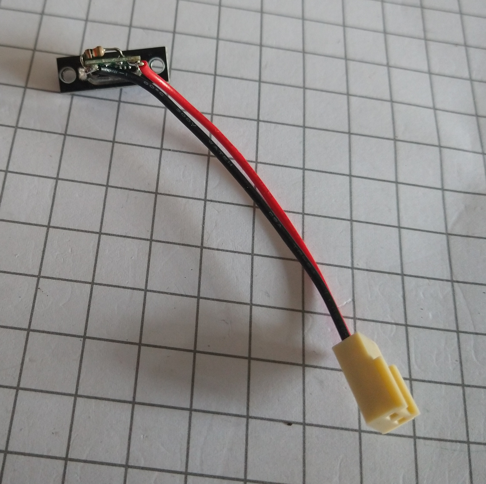
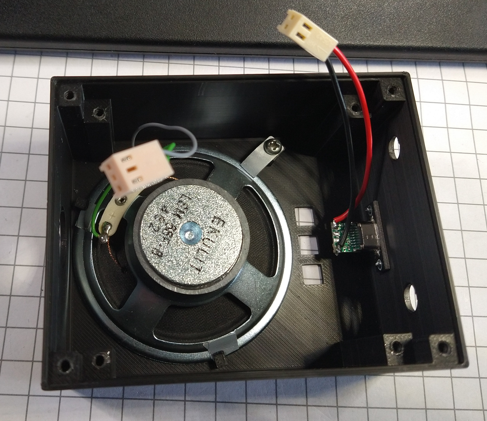
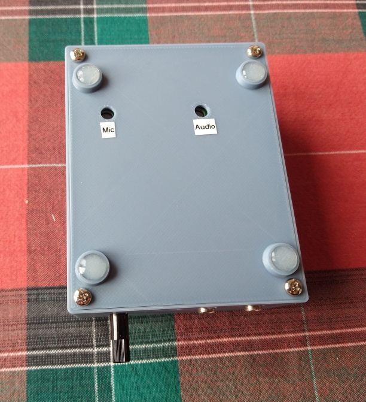

# Aufbau und Inbetriebnahme des Walkie-Talkie Keyers

## Gehäuse

Das Gehäuse besteht aus:

- Dem Oberteil, das es in zwei Varianten gibt, je nachdem ob die USB Buchse auf dem Board verwendet wird, oder nicht.
- Dem Unterteil.
- Den Verlängerungen für die Drucktaster.
- Die optionale Beschriftung für die Tasten.

Ich habe das Gehäuse mit einem BambuLab P2S in PLA gedruckt. Besitzer von
BambuLab Druckern können die bereitgestellten 3mf Dateien verwenden. Diese
enthalten alle Einstellungen, wie sie von mir vorgenommen werden. Ggf. ist das
Filament noch zu korrigieren.

Hinweise für Besitzer anderer Drucker: Der Ausdruck insbesondere des Oberteils
sollte mit einer höheren Auflösung erfolgen, damit die Halterungen für den
Lautsprecher und die Ausschnitte für die Druckschalter passen.

Die Beschriftungen der Verlängerungen für die Druckschalter habe ich mit einem
andersfarbigen Filament vorgenommen (schwarzes Gehäuse, orange Beschriftung).
Das funktioniert nur sinnvoll mit einem Drucker, der mehrfarbigen Druck
unterstützt. Ist das nicht der Fall kann entweder das Label in derselben Farbe
wie die Verlängerung gedruckt, und danach lackiert werden, oder die
Beschriftung wird weggelassen und die Tasten werden später mit Aufklebern
markiert. Ein manueller Filamentwechsel ist auch möglich, dazu ist aber ein
Eingriff in den Druckprozess notwendig.

Nach dem Ausdruck ist es evtl. sinnvoll, auf der Unterseite die Löcher für die
Trimmer zur Einstellung von Lautstärke und Mikrofonpegel zu markieren.

## Aufbau

### USB Buchse J6 / Stecker J1

> [!IMPORTANT]
> Die USB Buchse J6 ist ein SMD Bauteil. Wenn sie verwendet wird (siehe unten), dann muss sie **unbedingt** als erstes auf dem ansonsten leeren Board montiert werden. Danach sind alle 6 Anschlüsse mit dem Durchgangsprüfer auf Kurzschlüsse, insbesondere gegen Masse zu prüfen! Fehler die hier gemacht werden sind kaum noch zu korrigieren, sobald weitere Teile bestückt wurden! 

Wer Probleme hat, die Buchse zu löten, kann stattdessen die beim Prototypen
verwendete Einbaubuchse verwenden. In diesem Fall werden die USB Buchse J6 und
der Widerstand R15 auf dem Board **nicht** bestückt. R15 muss statt auf dem
Board an der USB Einbaubuchse zwischen CC1 und Masse verlötet werden. Dabei
ist darauf zu achten, dass dieser nicht mit den Drucktastern kollidiert.
 Die Einbaubuchse wird (in
richtiger Polung!) mit J1 verbunden. Der Widerstand R15 kann auch weggelassen
werden, dann funktioniert die Stromversorgung aber nur über USB Netzteile,
nicht über Handys etc.

Wird die USB Buchse J6 bestückt, dann braucht J1 nicht unbedingt bestückt zu
werden. Eine bestückte Buchse erleichtert aber die Tests.

### Fassungen

Für die beiden ICs würde ich Fassungen empfehlen.

### Programmierstecker

> [!CAUTION]
> Der 6-polige Programmierstecker auf dem Board hat keine Markierung für Pin 1. Diese ist nur aus dem Platinenaufdruck ersichtlich, der aber durch den Einbau verdeckt wird. Deshalb ist es sinnvoll, Pin 1 des Steckers mit Edding o.ä. auf der Platine zu markieren, damit beim Programmieren der Stecker nicht falsch herum aufgesteckt wird.

Falls der Stecker bei Reichelt bestellt wird, würde ich empfehlen, nicht das
in der Teileliste angegebene, genau passende Teil "MPE 087-2-006" zu nehmen,
sondern eine längere Leiste (z.B. "BKL 10120172") und das passende Stück
abzutrennen. Die Leisten sind teilbar, und längere Leisten sind im Verhältnis
deutlich billiger als kürzere. Das gilt insbesondere, wenn mehrere Platinen
aufgebaut werden.

### Programmierung

Die Programmierung der AVR CPU bzw. die Schaltung der Fuses geht aus dem
Makefile hervor.

### MKS Kondensatoren

Die verwendeten MKS Kondensatoren in den NF Zweigen sind recht teuer (ca.
0,30€ pro Stück). Die Verwendung von Keramik-Kondensatoren ist wahrscheinlich
auch möglich, wurde aber von mir nicht getestet.

### Anschluß J3

Anstelle der in der Teileliste aufgeführten 3-poligen Buchsen/Stecker können
auch simple einreihige Stiftleisten mit passenden Stecker aus
ausgeschlachteten PCs verwendet werden. Die Polung ist beim Lautsprecher egal,
der Einbaustecker muss deshalb keinen Verpolungsschutz haben.

### Ferritperlen

Die Ferritperlen wurden von mir als Vorsichtsmaßnahme vorgesehen um die
Eintrahlfestigkeit zu erhöhen. Sie sind für die eigentliche Funktion des
Keyers nicht notwendig. Ein Test mit einem Aufbau ohne die Ferritperlen hat
tatsächlich einen Effekt gezeigt, deshalb sind diese weiterhin auf dem Board
vorhanden. Bei Verwendung des Keyers an einem Gerät mit abgesetzter Antenne
sollte es aber auch möglich sein, sie durch Drahtbrücken zu ersetzen.

Falls trotz der Ferritperlen Probleme mit Eintrahlung auftreten können
zusätzliche 100pF Kondensatoren gegen Masse jeweils vor und/oder nach den
Ferritperlen helfen. Die große Kupferfläche auf Ober- und Unterseite der
Platine ist Masse.

### DIN Stecker

Die Schaltung verwendet einen 5-poligen Stecker. Es können aber auch 7-polige
Buchsen bzw. Stecker verbaut werden, falls jemand diese in der Vorratskiste
hat. Die zusätzlichen Pins bleiben dann unbeschaltet.

### Transistor Q1

Der Transistor schaltet PTT gegen Masse. Es kann auch ein sonstiger
Kleinleistungstyp wie BC237 o.ä bestückt werden. Dabei ist darauf zu achten,
dass die Type aus der BC... Reihe eine andere Anschlußbelegung haben, als der
2N3904 und deshalb anders als im Bestückungsdruck ersichtlich bestückt werden
müssen.

### Lautsprecher

Für die Schraub-Befestigung wird ein kleiner Blechstreifen verwendet.
 Auf ein eigenes Bauteil aus dem
3D Drucker habe ich verzichtet.

Die Haken für die Befestigung des Lautsprechers sind relativ kritisch in der
Bemaßung. Es kann deshalb sein, dass sie bei anderen Druckern oder einer
anderen Druckauflösung zu viel Raum lassen. Das läßt sich mit kleinen Streifen
Gewebeband zwischen Lautsprecher und Haken korrigieren.

Der verwendete Lautsprecher wurde bewusst recht groß gewählt um eine gute
Audio-Qualität zu gewährleisten. Es ist denkbar, hier auch kleinere bzw.
flachere Typen einzusetzen, was auch eine niedrigere Gehäuseform ermöglichen
würde. Dabei ist darauf zu achten, dass die Eigenresonanzfrequenz des
Lautsprechers möglichst tief ist, weil sonst unangenehme Resonanzen auftreten
können.

### USB Netzteile

Wird ein USB Netzteil zur Stromversorgung verwendet, dann kann es durch
mangelnde Siebung zu Geräuschen (üblicherweise ein leiser, hoher Ton) im Audio
kommen. Abhilfe kann ein besseres Netzteil, ein größerer Kondensator C13, oder
ein zusätzlicher Kondensator direkt an der USB Buchse schaffen.

### Tastenverlängerungen

> [!TIP]
> Die ausgedruckten "Verlängerungen" für die Drucktaster werden am besten erst gesteckt, wenn die Platine im Gehäuse montiert wurde. Wenn sie bereits vorher aufgesteckt werden, dann gestaltet sich das "Einfädeln" der Platine in die Gehäuseausbrüche etwas schwierig.

## Inbetriebnahme

### Bestückung prüfen

> [!NOTE]
> Bitte vor der Inbetriebnahme nochmals die Elektrolytkondensatoren und den Transistor Q1 auf richtige Polung prüfen! Die ICs sind vorerst nicht zu stecken.

### Stromversorgung prüfen

Nach Bestückung aller Bauteile **mit Ausnahme der beiden ICs** wird das Board
über den Stecker J1 und ein 5V Netzgerät mit einstellbarer Strombegrenzung mit
Strom versorgt. Die Strombegrenzung ist auf 10-20mA einzustellen. Nach dem
Einschalten darf kein messbarer Strom fliessen. Die Elektrolytkondensatoren
dürfen nicht warm werden.

An IC1 Pin 7 und IC2 Pin müssen 5V gegen Masse (die große Fläche auf dem
Board, abzugreifen z.B. an den Löchern für die Befestigungsschrauben) zu
messen sein.

Wenn die USB-Buchse J6 bestückt ist: Verbindung zur Stromversorgung lösen und
stattdessen zuerst eine USB Stromversorgung und dann ein Handy an die USB
Buchse anschließen und jedesmal prüfen, ob an den ICs 5V anliegen.

### Erster Test

Den AVR programmieren und beide ICs in die Fassungen einsetzen.

> [!IMPORTANT]
> Fuses nicht vergessen! Sonst ergeben sich seltsame Effekte.
  
Paddle und Kophörer anschliessen.

Den Lautstärkeregler ganz nach links drehen.

Die beiden Trimmer RV1 und RV2 aus Sicht auf die Bestückungsseite zuerst ganz
nach links und dann ca. 1/4 des Drehbereichs wieder nach rechts drehen.

Das Board über J1 an ein Netzgerät mit 5V anschliessen. Strombegrenzung auf
20mA stellen und einschalten. Der aufgenommene Strom beträgt knapp 10mA. Wenn
das ok ist, die Strombegrenzung auf 100mA erhöhen.

Rechtes Paddle drücken und den Lautstärkeregler langsam nach rechts drehen. Es
müssten "Dahs" zu hören sein. Linkes Paddle produziert "Dits".

### Walkie-Talkie Anschluß

> [!IMPORTANT]
> Die folgende Information bezieht sich auf Funkgeräte mit Kenwood Anschluss.

Stromversorgung abschalten, Anschlusskabel zum Funkgerät in das Board
einstecken. Kein Funkgerät anschliessen.

Das Verbindungskabel mit dem Durchgangsprüfer messen. Das ist recht einfach,
weil alle Kabel-Pins über Ferritperlen gehen, an denen sich das Signal recht
einfach abgreifen läßt.

- FB1 geht an den äußeren Ring des 3,5mm Steckers.
- FB2 geht an den mittleren Ring des 3,5mm Steckers.
- FB3 geht an den äußeren Ring des 2,5mm Steckers.
- FB4 geht an die Spitze des 2,5mm Steckers.
- Die Spitze des 3,5mm Steckers und der mittlere Ring des 2,5mm Steckers sind unbeschaltet.

Danach ein Funkgerät mit Kenwood Belegung anschliessen und einschalten. Ggf.
Dummy Load anschliessen. Wird zum Test der Squelch des Funkgeräts
freigeschaltet, dann muss das Audio Signal des Funkgeräts über den
Lautsprecher des Keyers ausgegeben werden. Es kann auch ein zweites Funkgerät
zur Generierung eines Audio-Signals verwendet werden. Die Lautstärke kann mit
RV2 so eingestellt werden, dass sie zur Lautstärke des Mithörtons passt.
Danach kann sie am Funkgerät geregelt werden.

Dann den Keyer tasten. Das Funkgerät muss auf Sendung und danach wieder auf
Empfang schalten.

Mit einem zweiten Funkgerät wird das gesendete Signal überprüft. Es hat eine
kleine Verzögerung gegenüber dem vom Keyer generierten Mithörton. Der Pegel
des Sendesignals kann mit RV1 geregelt werden und ist so einzustellen, dass
der maximale Hub nicht überschritten wird.

> [!IMPORTANT]
> Der Pegel des Sendesignals ist aufgrund des Tiefpasses etwas von der Frequenz des gesendeten Tons abhängig. Wer es besonders gut machen will, stellt erst die gewünschte Tonfrequenz und dann den Mikrofonpegel ein. Da der verwendete Hub aber unter dem maximalen liegen sollte und übliche Funkgeräte das Eingangssignal limitieren sollten in der Praxis auch bei einer späteren Änderung der Tonhöhe keine Probleme auftreten.

> [!IMPORTANT]
> Auf V2 des Boards haben die beiden Trimmer bei Sicht auf die Unterseite die "falsche" Drehrichtung. Rechtsdrehung (im Uhrzeigersinn) ist Minimum.

### Einbau und Abschluß

Die Platine in das Gehäuse einbauen. Die Platine muss dazu zuerst schräg
eingesetzt und dann das Gehäuse mit etwas Kraft gebogen werden, damit der DIN
Stecker "reinflutscht". Die Verlängerungen für die Druckschalter stecken.
Gummifüße montieren. Gerät nochmals testen.

Das war's - viel Spaß mit dem Gerät!

